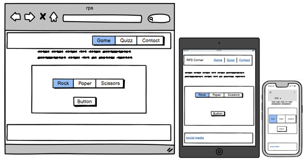
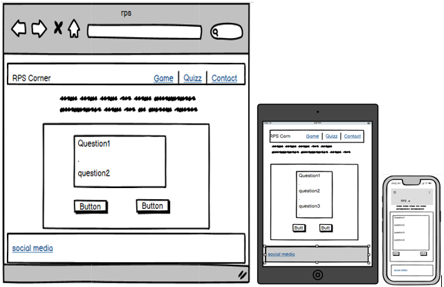
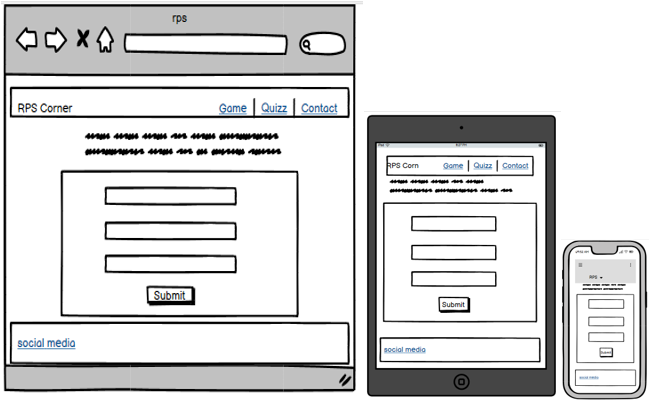
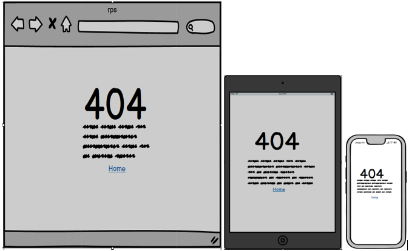

# RPS Corner
RPS Corner is an esquisse ,for fans of rock paper scissors, who just want to relax and indulge in their favourite game, while learning something new about the game and increase their general knowledge at the same time. Everything on this site is about Rock paper scissors. You are only a click away from your favourite social media link!!!!
 
View the live site [here](https://bwogit.github.io/CI_PP2_GAME/index.html)
  

 

# Table of Contents
Table of Content
  - [Project Goals](#project-goals)
    - [User Goals](#user-goals)
    - [Site Owner Goals](#site-owner-goals)
  - [User Experience](#user-experience)
    - [Target Audience](#target-audience)
    - [User Requirements and Expectations](#user-requirements-and-expectations)
  - [User Stories](#user-stories)
    - [Site User](#site-user)
    - [Site Owner](#site-owner)
  - [Design](#design)
    - [Colour Scheme](#colour-scheme)
    - [Fonts](#fonts)
    - [Structure](#structure)
    - [Wireframes](#wireframes)
  - [Technologies Used](#technologies-used)
    - [Languages](#languages)
    - [Frameworks, Libraries & Tools](#frameworks-libraries--tools)
  - [Features](#features)
  - [Validation](#validation)
    - [HTML Validation](#html-validation)
    - [CSS Validation](#css-validation)
    - [JavaScript Validation](#javascript-validation)
    - [Accessibility](#accessibility)
    - [Performance](#performance)
  - [Testing](#testing)
    - [Performing tests on various devices](#performing-tests-on-various-devices)
    - [Browser compatibility](#browser-compatibility)
    - [Testing user stories](#testing-user-stories)
  - [Bugs](#bugs)
  - [Deployment](#deployment)
  - [Credits](#credits)
  - [Acknowledgements](#acknowledgements)

## Project Goals

Create an interactive and user-friendly rendition of an all time favorite among enthusiasts.

### User Goals

- Relax and play an old school game with that is fun and engaging
- You think you know all about RPS? then why don't you test yourself with the 4 question mini quizz about RPS

### Site Owner Goals

- Create a Website which offers 2 games which are fun and engaging
- Increase your general knowledge by reading the quote of the day
- Create a simple design let the games talk the talk
- Provide feedback when playing game or quizz 
- Create a simple navigation around website
- Provide fully responsive and accessible website

## User Experience

### Target Audience

- The game is for RPS nuts!
- The game can be played by anyone who likes Rock, Paper, Scissors (RPS)
- Anyone who wants to learn facts about their favourite game

### User Requirements and Expectations

- Accessibility
- Simple navigation
- Simple presentation of content that makes logical sense
- A responsive website so the user can play the game on any device
- Links and functions that work as expected
- An easy way to contact the developer and leave feedback

## User Stories

### Site User

1. I want to easily understand the rules of the game
2. I want to be able to see my score and computer score
3. I want to be able to navigate the site intuitively
4. I want to be able to see who is winning each play
5. I want to be able to reset the game mid game
6. I want to be able to see choose my deck of questions
7. I want to see my which question i got right or wrong
8. I want to be able to play the game on desktop, tablet and mobile devices
9. I want to be able to get in touch with the developer
10. I want confirmation that my message has been sent

### Site Owner

11. I want user to easily keep in touch with social medi within the site
12. I want the user to be able to challenge themselves
13. I want the user to play and learn at the same time
14. I want my site to be fully responsive
15. I want the user to land on 404 error page if they navigate to url that does not exist
16. I want user to be able to contact me and provide their feedback

### Colour Scheme

The colour scheme across the screens was kept simple and consistent as to allow accessibility. 
- Game - Win is green and a loss(computer wins) is red
- Quizz - right answer is green, wrong anser is red

### Fonts

Google Fonts were implemented on the website. Lexend with sans-serif fallback was used across all pages as they are dyslexia friendly. 

### Structure

The website structure was designed for easy learning and navigation. Each page of the website has the same container structure which maintains a certain harmony.

- The website consist of 3 pages which all have the same header and footer elements and quote of the day
  - header has the title and navigation
  - Main page - quote of the day and computer and player scores
    
  - Quizz page - Consist of 4 question MCQ taken at random out of a list of 13 (for this version of the game). Each question has 4 possible answers (a, b, c, d) upon submitting the answesr each question answerd right is lit grenn, and each wrong answer is red. The game doesn't provide the right answer. The player has the possibility to select one of the 3 other solutions and re-submit. The purpose of the game is to learn! 
  
- The contact page with contact form which enables users to contact to the developer and provide their feedback
- A separate 404 error page

### Wireframes

Main page - Game

quizz

Contact

404

## Technologies Used

### Languages

- HTML
- CSS
- JavaScript

### Frameworks, Libraries & Tools

- [Balsamiq](https://balsamiq.com/) to create the wireframes
- [EmailJS](https://www.emailjs.com) sending email from the contact form
- [Favicon.io](https://favicon.io) for site favicon
- [Font Awesome](https://fontawesome.com/) - each page of the site uses fontawesome icons
- [GitHub](https://github.com/) to store project code on the cloud
- [Google Fonts](https://fonts.google.com/)
- [Chrome dev tools](https://developers.google.com/web/tools/chrome-devtools) for code debugging and check site responsiveness
- [Am I Responsive](http://ami.responsivedesign.is/) for multi-device mock-up.
- [WC3 Validator](https://validator.w3.org/), [Jigsaw W3 Validator](https://jigsaw.w3.org/css-validator/), [JShint](https://jshint.com/), [Wave Validator](https://wave.webaim.org/), [Lighthouse](https://developers.google.com/web/tools/lighthouse/) were all used to validate the website.

## Features

The website has 3 webpages consisting of  distinct features described below

### Navigation Bar
Navigation bar of the website, and is displayed on the 3 pages (Homepage), Game, Quiz and Contact. The navigation bar is responsive down to hamburger menu on mobile devices.
- user story covered (3, 14, 8)

See feature

### help Modal
Game instructions which pops up when the help icon is clicked 
- user story covered 

See feature

See feature

#### Quote of the day
Never a bad moment to learn something. Quotes from famous people. Everytime the page is refreshed a new quote is published. Present on all pages

- user story covered 13

See feature

### Footer 
- Present on all pages. Provide a natural intuitive space to access socila media directly. link   presents are Instagran, Facebook, Youtube and EventBrite.

- user story covered 11

See feature

### scores
- Colour coded scores. Every time the computer wins the computer score is displayed in red, when the player winds the hand the player's score is diaplyed in green. 

- User story covered 2, 4

See feature

See feature

### Reset 
- Sometimes the game is frustrating, the player is not in the right framme of ming or sometimes you are on a loosing streak? Don't worry you are able to rset the gae and start afresh! Good luck!

- user story covered 5

See feature

### Rock Paper Scissors game

- interactive game : user plays agains the computer by selecting either rock, paper or scissors. For each play the game displays the user choice and the computer choice and the outcome of that hand. The score is updated after each play. 

- user stories covered 2, 4, 5

See feature

### Quizz 

- interactive quiz of 4 questions taken randomly out of a pack of questions so that regular users can come back (when they hit submit questions answered correctly will be in green otherwise they will be red. The quiz stops when the computes wins 3 times 

- User stories covered 2, 4, 12

See feature

### Shuffle button

- Allows the regular user to take the quiz with different set of questions in no predetermined order increasing the interactivity of the site. you can play as much as you want and never find the same set of quations in the same oredr twice.

- User Stories covered 12, 13, 6, 7

See feature

### Page 404

- Lets the user know that there is an error with their request. Perhaps they mistyped the URL, the page is temporarily unavailable, or the page no longer exists. This feature will recognize the mistake and guide them back to the home page of the site.

- User story covered 15

See feature

### Contact Form

- Contact forms makes it simple for the user to contact the owner or developper if they need support or more information about the services offered in the website. 

- User story covered 9, 16

See feature

### Contact form confirmation

-  It is an essential segment of email marketing. A confirmation message, displays after a user fills out the form. it is there to inform the user that their message has been sent successfully, and when they’ll receive a response from you.

- user story covered 10

See feature

