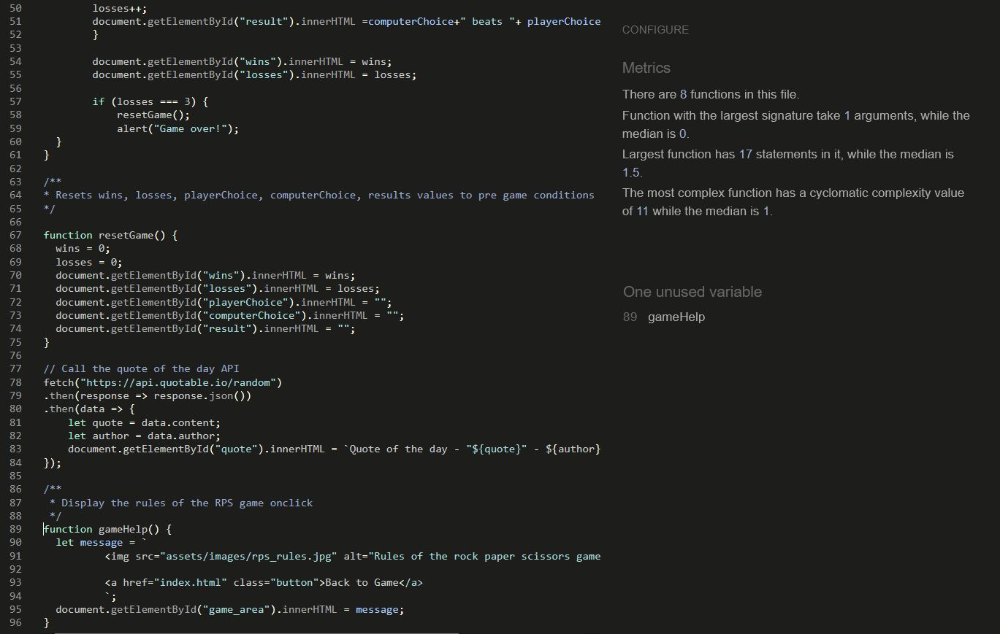
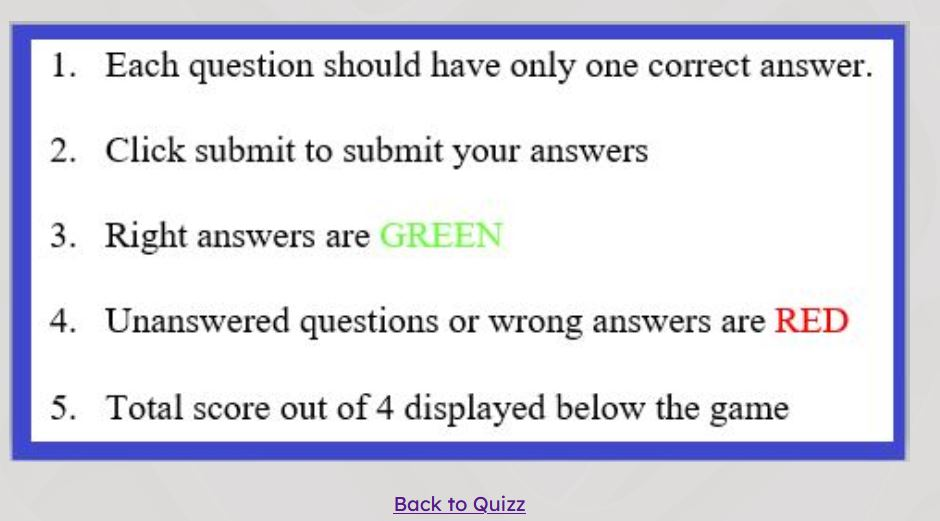
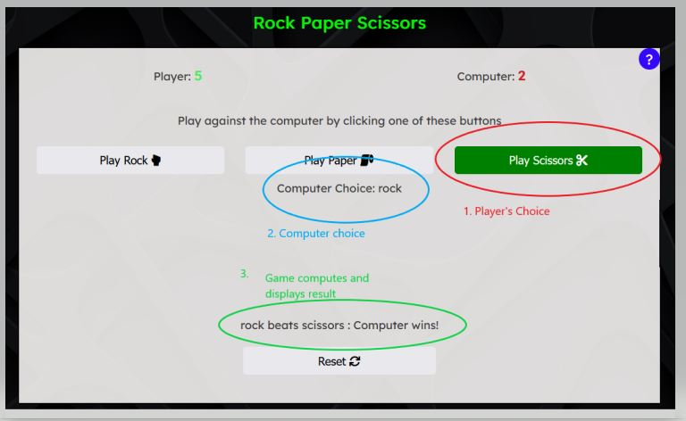
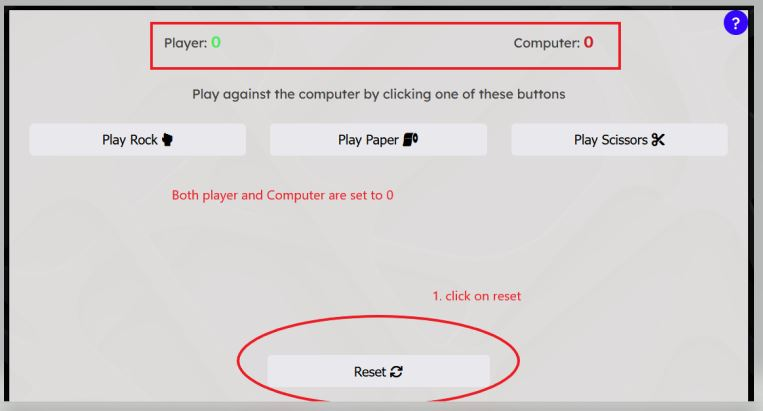
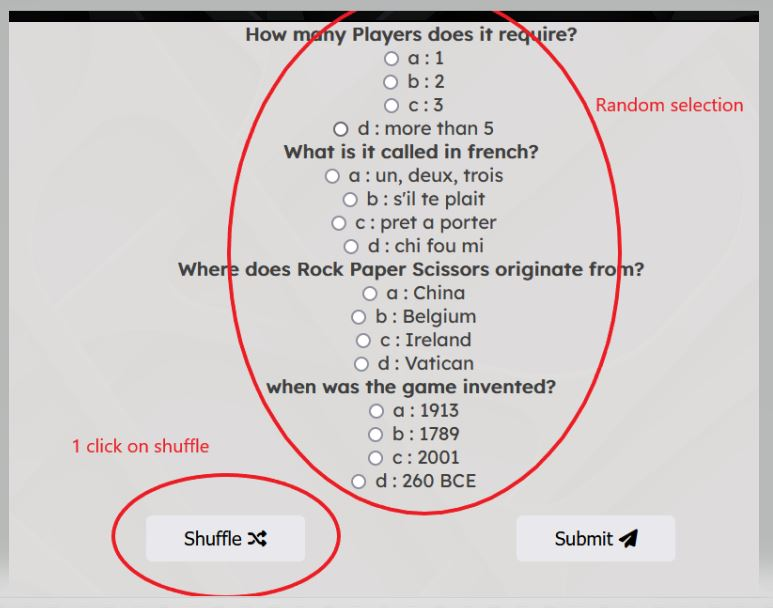

# RPS Corner
RPS Corner is an esquisse ,for fans of rock paper scissors, who just want to relax and indulge in their favourite game, while learning something new about the game and increase their general knowledge at the same time. Everything on this site is about Rock paper scissors. You are only a click away from your favourite social media link!!!!
 
View the live site [here](https://bwogit.github.io/CI_PP2_GAME/index.html)
  

 

# Table of Contents
Table of Content
  - [Project Goals](#project-goals)
    - [User Goals](#user-goals)
    - [Site Owner Goals](#site-owner-goals)
  - [User Experience](#user-experience)
    - [Target Audience](#target-audience)
    - [User Requirements and Expectations](#user-requirements-and-expectations)
  - [User Stories](#user-stories)
    - [Site User](#site-user)
    - [Site Owner](#site-owner)
  - [Design](#design)
    - [Colour Scheme](#colour-scheme)
    - [Fonts](#fonts)
    - [Structure](#structure)
    - [Wireframes](#wireframes)
  - [Technologies Used](#technologies-used)
    - [Languages](#languages)
    - [Frameworks, Libraries & Tools](#frameworks-libraries--tools)
  - [Features](#features)
  - [Validation](#validation)
    - [HTML Validation](#html-validation)
    - [CSS Validation](#css-validation)
    - [JavaScript Validation](#javascript-validation)
    - [Accessibility](#accessibility)
    - [Performance](#performance)
  - [Testing](#testing)
    - [Performing tests on various devices](#performing-tests-on-various-devices)
    - [Browser compatibility](#browser-compatibility)
    - [Testing user stories](#testing-user-stories)
  - [Bugs](#bugs)
  - [Deployment](#deployment)
  - [Credits](#credits)
  - [Acknowledgements](#acknowledgements)

## Project Goals

Create an interactive and user-friendly rendition of an all time favorite among enthusiasts.

### User Goals

- Relax and play an old school game with that is fun and engaging
- You think you know all about RPS? then why don't you test yourself with the 4 question mini quizz about RPS

### Site Owner Goals

- Create a Website which offers 2 games which are fun and engaging
- Increase your general knowledge by reading the quote of the day
- Create a simple design let the games talk the talk
- Provide feedback when playing game or quizz 
- Create a simple navigation around website
- Provide fully responsive and accessible website

## User Experience

### Target Audience

- The game is for RPS nuts!
- The game can be played by anyone who likes Rock, Paper, Scissors (RPS)
- Anyone who wants to learn facts about their favourite game

### User Requirements and Expectations

- Accessibility
- Simple navigation
- Simple presentation of content that makes logical sense
- A responsive website so the user can play the game on any device
- Links and functions that work as expected
- An easy way to contact the developer and leave feedback

## User Stories

### Site User

1. I want help on how how to play the game
2. I want to be able to see the player and computer scores
3. I want to be able to navigate the site intuitively
4. I want to be able to see who is winning each play
5. I want to be able to reset the game mid game
6. I want to be able to see choose my deck of questions
7. I want to see my which question I got right or wrong
8. I want to be able to play the game on desktop, tablet and mobile devices
9. I want to be able to get in touch with the developer
10. I want confirmation that my message has been sent

### Site Owner

11. I want user to easily access social media within the site
12. I want the user to be able to challenge themselves
13. I want the user to play and learn at the same time
14. I want my site to be fully responsive
15. I want the user to land on 404 error page if they navigate to url that does not exist
16. I want user to be able to contact me and provide their feedback

### Colour Scheme

The colour scheme across the screens was kept simple and consistent as to allow accessibility. 
- Game - Win is green and a loss(computer wins) is red
- Quizz - right answer is green, wrong anser is red

### Fonts

Google Fonts were implemented on the website. Lexend with sans-serif fallback was used across all pages as they are dyslexia friendly. 

### Structure

The website structure was designed for easy learning and navigation. Each page of the website has the same container structure which maintains a certain harmony.

- The website consist of 3 pages which all have the same header and footer elements and quote of the day
  - header has the title and navigation
  - Main page - quote of the day and computer and player scores
    
  - Quizz page - Consist of 4 question MCQ taken at random out of a list of 13 (for this version of the game). Each question has 4 possible answers (a, b, c, d) upon submitting the answesr each question answerd right is lit grenn, and each wrong answer is red. The game doesn't provide the right answer. The player has the possibility to select one of the 3 other solutions and re-submit. The purpose of the game is to learn! 
  
- The contact page with contact form which enables users to contact to the developer and provide their feedback
- A separate 404 error page

### Wireframes

Main page - Game

quizz

Contact

404

## Technologies Used

### Languages

- HTML
- CSS
- JavaScript

### Frameworks, Libraries & Tools

- [Balsamiq](https://balsamiq.com/) to create the wireframes
- [EmailJS](https://www.emailjs.com) sending email from the contact form
- [Favicon.io](https://favicon.io) for site favicon
- [Font Awesome](https://fontawesome.com/) - each page of the site uses fontawesome icons
- [GitHub](https://github.com/) to store project code on the cloud
- [Google Fonts](https://fonts.google.com/)
- [Chrome dev tools](https://developers.google.com/web/tools/chrome-devtools) for code debugging and check site responsiveness
- [Am I Responsive](http://ami.responsivedesign.is/) for multi-device mock-up.
- [WC3 Validator](https://validator.w3.org/), [Jigsaw W3 Validator](https://jigsaw.w3.org/css-validator/), [JShint](https://jshint.com/), [Wave Validator](https://wave.webaim.org/), [Lighthouse](https://developers.google.com/web/tools/lighthouse/) were all used to validate the website.

## Features

The website has 3 webpages consisting of  distinct features described below

### Navigation Bar
Navigation bar of the website, and is displayed on the 3 pages (Homepage), Game, Quiz and Contact. The navigation bar is responsive down to hamburger menu on mobile devices.
- user story covered (3, 14, 8)

See feature

### help Modal
Game instructions which pops up when the help icon is clicked 
- user story covered 

See feature

See feature

#### Quote of the day
Never a bad moment to learn something. Quotes from famous people. Everytime the page is refreshed a new quote is published. Present on all pages

- user story covered 13

See feature

### Footer 
- Present on all pages. Provide a natural intuitive space to access socila media directly. link   presents are Instagran, Facebook, Youtube and EventBrite.

- user story covered 11

See feature

### scores
- Colour coded scores. Every time the computer wins the computer score is displayed in red, when the player winds the hand the player's score is diaplyed in green. 

- User story covered 2, 4

See feature

See feature

### Reset 
- Sometimes the game is frustrating, the player is not in the right framme of ming or sometimes you are on a loosing streak? Don't worry you are able to rset the gae and start afresh! Good luck!

- user story covered 5

See feature

### Rock Paper Scissors game

- interactive game : user plays agains the computer by selecting either rock, paper or scissors. For each play the game displays the user choice and the computer choice and the outcome of that hand. The score is updated after each play. 

- user stories covered 2, 4, 5

See feature

### Quizz 

- interactive quiz of 4 questions taken randomly out of a pack of questions so that regular users can come back (when they hit submit questions answered correctly will be in green otherwise they will be red. The quiz stops when the computes wins 3 times 

- User stories covered 2, 4, 12

See feature

### Shuffle button

- Allows the regular user to take the quiz with different set of questions in no predetermined order increasing the interactivity of the site. you can play as much as you want and never find the same set of quations in the same oredr twice.

- User Stories covered 12, 13, 6, 7

See feature

### Page 404

- Lets the user know that there is an error with their request. Perhaps they mistyped the URL, the page is temporarily unavailable, or the page no longer exists. This feature will recognize the mistake and guide them back to the home page of the site.

- User story covered 15

See feature

### Contact Form

- Contact forms makes it simple for the user to contact the owner or developper if they need support or more information about the services offered in the website. 

- User story covered 9, 16

See feature

### Contact form confirmation

-  It is an essential segment of email marketing. A confirmation message, displays after a user fills out the form. it is there to inform the user that their message has been sent successfully, and when they’ll receive a response from you.

- user story covered 10

See feature

## Validation

### HTML Validation

- The W3C Markup Validation Service was used to validate the HTML of the website. All pages pass with no errors.

- index.html [results](https://validator.w3.org/nu/?doc=https%3A%2F%2Fbwogit.github.io%2FCI_PP2_GAME%2Findex.html) - No errors found

- quizz.html [results](https://validator.w3.org/nu/?doc=https%3A%2F%2Fbwogit.github.io%2FCI_PP2_GAME%2Fquizz.html) - No errors

- contact.html [results](https://validator.w3.org/nu/?doc=https%3A%2F%2Fbwogit.github.io%2FCI_PP2_GAME%2Fcontact.html) - No errors

### CSS Validation

The W3C Jigsaw CSS Validation Service was used to validate the CSS of the website.
When validating all website, it passes with no errors.

- site [results](https://jigsaw.w3.org/css-validator/validator?uri=https%3A%2F%2Fbwogit.github.io%2FCI_PP2_GAME%2Findex.html&profile=css3svg&usermedium=all&warning=1&vextwarning=&lang=en) - No errors

### JS validation

JSHint JS Validation Service was used to validate the Javascript files. No significant issues were found.

game.js

game.js

game.js

### Accessibility

The WAVE WebAIM web accessibility evaluation tool was used to ensure the website met high accessibility standards.
All site pass with no errors whatsoever!

- index.html [results](https://wave.webaim.org/report#/https://bwogit.github.io/CI_PP2_GAME/index.html) - No errors
- quizz.html [results](https://wave.webaim.org/report#/https://bwogit.github.io/CI_PP2_GAME/quizz.html) - No errors
- contact.html [results](https://wave.webaim.org/report#/https://bwogit.github.io/CI_PP2_GAME/contact.html)
- 404.html[results](https://wave.webaim.org/report#/https://bwogit.github.io/CI_PP2_GAME/404.html) 

### Performance
Google Lighthouse in Google Chrome Developer Tools was the tool used to test the website perforances.

index.html

quizz.html

contact.html
 

404.html

## Testing

### Performing tests on various devices

I used Google Chrome Developer Tools Toggle Device Toolbar to simulate below viewports 

- Large desktops (1600 x 992)
- Laptop screens (1280 x 802)
- Tablets (768 x 1024)
- Small phones (320 x 480)

### Browser compatibility

- Testing has been carried out on the following browsers:
  - Googe Chrome Version 110.0.5481.100 (Official Build) (64-bit)
  - Microsoft Edge Version 110.0.1587.46 (Official build) (64-bit)
  - Firefox Browser 109.0.1 (64-bit)

### Testing user stories

1. I want help on how how to play the game

| **Feature**       | **Action**        | **Expected Result**                  | **Actual Result** |
| ----------------- | ----------------- | ------------------------------------ | ----------------- |
| help Icon | Click on the icon | instructions pops up | Works as expected |

Screenshot

2. I want to be able to see the player and computer scores

| **Feature**    | **Action**                                                           | **Expected Result**                               | **Actual Result** |
| -------------- | -------------------------------------------------------------------- | ------------------------------------------------- | ----------------- |
| Score area | Green for player and Red for computer  | scores are incremented red for computer green for player | Works as expected |

Screenshot

3. I want to be able to navigate the site intuitively

| **Feature**    | **Action**                                                           | **Expected Result**                               | **Actual Result** |
| -------------- | -------------------------------------------------------------------- | ------------------------------------------------- | ----------------- |
| Nav bar in Header | same vavigation bar fro the 3 pages  | Very intuitive and the user knows where the links are supposed to be | Works as expected |

Screenshot

4.	I want to be able to see who is winning each play

| **Feature**    | **Action**                                                           | **Expected Result**                               | **Actual Result** |
| -------------- | -------------------------------------------------------------------- | ------------------------------------------------- | ----------------- |
| Result div| Game takes players play and Computers and computes results  | displays the result of the hand | Works as expected |

Screenshot

5.	I want to be able to reset the game mid game

| **Feature**    | **Action**                                                           | **Expected Result**                               | **Actual Result** |
| -------------- | -------------------------------------------------------------------- | ------------------------------------------------- | ----------------- |
| Reset buton| Click with the mouse on the button  | Resets scores to zero  | Works as expected |

Screenshot

6.	I want to be able to choose my deck of questions

| **Feature**    | **Action**                                                           | **Expected Result**                               | **Actual Result** |
| -------------- | -------------------------------------------------------------------- | ------------------------------------------------- | ----------------- |
| shuffle buton| Click with the mouse on the button  | random selection of 4 questions from the pot  | Works as expected |

Screenshot

7.	I want to see my which question I got right or wrong

| **Feature**    | **Action**                                                           | **Expected Result**                               | **Actual Result** |
| -------------- | -------------------------------------------------------------------- | ------------------------------------------------- | ----------------- |
|submit buton| Click with the mouse on the button  | Green = correct, red = wrong | Works as expected |

Screenshot

8.	I want to be able to play the game on desktop, tablet and mobile devices

| **Feature**    | **Action**                                                           | **Expected Result**                               | **Actual Result** |
| -------------- | -------------------------------------------------------------------- | ------------------------------------------------- | ----------------- |
|fully responsive site| design with responsivenesss in mind  | fully responsive | Works as expected |

Screenshot

9.	I want to be able to get in touch with the developer

| **Feature**    | **Action**                                                           | **Expected Result**                               | **Actual Result** |
| -------------- | -------------------------------------------------------------------- | ------------------------------------------------- | ----------------- |
|form page| Contact form with EmailJS capabilities  | Receive mail confirmation | Works as expected |

Screenshot

10. I want confirmation that my message has been sent

| **Feature**    | **Action**                                                           | **Expected Result**                               | **Actual Result** |
| -------------- | -------------------------------------------------------------------- | ------------------------------------------------- | ----------------- |
|form page| fill the form and click on submit  | Receive confirmation | Works as expected |

Screenshot

11.	I want users to easily access social media within the site

| **Feature**    | **Action**                                                           | **Expected Result**                               | **Actual Result** |
| -------------- | -------------------------------------------------------------------- | ------------------------------------------------- | ----------------- |
|footer| click on the social media icon  | open in a new tab social media page | Works as expected |

Screenshot

12.	I want the user to be able to challenge themselves

| **Feature**    | **Action**                                                           | **Expected Result**                               | **Actual Result** |
| -------------- | -------------------------------------------------------------------- | ------------------------------------------------- | ----------------- |
| shuffle buton| Click with the mouse on the button  | regular users will not get same questions | Works as expected |

Screenshot

13.	I want the user to play and learn at the same time

| **Feature**    | **Action**                                                           | **Expected Result**                               | **Actual Result** |
| -------------- | -------------------------------------------------------------------- | ------------------------------------------------- | ----------------- |
|Quote of the day| cick on a page link  | new quote is displayed | Works as expected |

Screenshot

14.	I want the site to be fully responsive

| **Feature**    | **Action**                                                           | **Expected Result**                               | **Actual Result** |
| -------------- | -------------------------------------------------------------------- | ------------------------------------------------- | ----------------- |
|fully responsive site| design with responsivenesss in mind  | fully responsive | Works as expected |

Screenshot

15.	I want the user to land on 404 error page if they navigate to url that does not exist

| **Feature**    | **Action**                                                           | **Expected Result**                               | **Actual Result** |
| -------------- | -------------------------------------------------------------------- | ------------------------------------------------- | ----------------- |
|page 404| if a link is broken or a page does not exist  | fully responsive 404 page with link back to home | Works as expected |

Screenshot

16.	I want user to be able to contact me and provide their feedback

| **Feature**    | **Action**                                                           | **Expected Result**                               | **Actual Result** |
| -------------- | -------------------------------------------------------------------- | ------------------------------------------------- | ----------------- |
|form page| Contact form with EmailJS capabilities  | Receive mail confirmation | Works as expected |

Screenshot

## bugs

| Fix                                                                                    |
| ------------------------------------------------------------------------------------------------------------------------------------------- | -------------------------------------------------------------------------------------- |

## Deployment

### GitHub Pages
The website was deployed using GitHub Pages by following these steps:
1. In GitHub repository cick on the Settings tab
2. On the left hand menu select Pages
3. For the source select Branch: main
4. Once saved, GitHub will refresh and your website will be publishd from GitHub repository
5. The link to your published website will appear: "Your site is published at https://bwogit.github.io/CI_PP2_GAME/

### Forking the GitHub Repository
1. Go to the GitHub repository
2. Click on Fork button in top right corner

### Making a Local Clone
1. Go to the GitHub repository 
2. Locate the Code button above the list of files and click it
3. Highlight the "HTTPS" button to clone with HTTPS and copy the link
4. Open Git Bash
5. Change the current working directory to the one where you want the cloned directory
6. Type git clone and paste the URL from the clipboard ($ git clone https://github.com/YOUR-USERNAME/YOUR-REPOSITORY)
7. Press Enter to create your local clone

## Credits

### Images

- All  icons throughout the site were taken from [Fontawesome](https://fontawesome.com/)
- Background image: photo found on [unsplash](https://unsplash.com/)
- Image for form confirmation was taken from [unsplash](https://unsplash.com/)

### code

- [EmailJS](https://www.emailjs.com/docs/tutorial/creating-contact-form) official tutorial & playground environment within EmailJS Email Templates were used to create a contact form with email being sent to desired address
-  [w3schools](https://www.w3schools.com/css/tryit.asp?filename=trycss_form_focus2) was reviewed to change input focus color

## Acknowledgements

